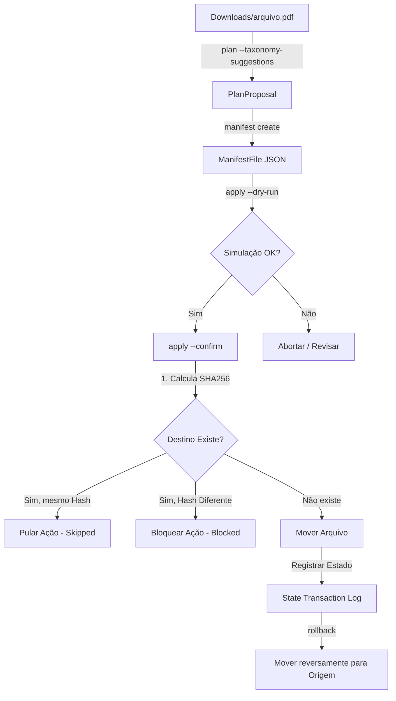

# Kryonix Home Brain — Modelo de Segurança Declarativa (Safety Model)

Este documento descreve o modelo de segurança e as salvaguardas declaradas no **Kryonix Home Brain (`kryonix-home`)** para proteger os arquivos locais do usuário contra corrupção, perda e apagamento acidental.

---

## 1. Princípios de Segurança

O Kryonix Home Brain segue uma política rígida de **Mutações Controladas e Reversíveis**:

1. **Inexistência de Auto-Delete**: O sistema **nunca** apaga arquivos na origem ou destino. Todas as operações estruturais são estritamente de movimentação (`move` / `rename`).
2. **Determinismo**: Uma ação física só ocorre após o planejador emitir uma proposta, o manifesto registrá-la formalmente, e o usuário invocar explicitamente o `apply --confirm`.
3. **Rollback de 100% de Fidelidade**: Toda movimentação aplicada gera uma transação de histórico no arquivo de estado. O comando `rollback` lê esse estado e move todos os arquivos de volta para suas posições e nomes exatos originais.

---

## 2. Modelo de Ameaças e Salvaguardas

Abaixo estão descritos os cenários de risco avaliados e as proteções implementadas no código Rust:

### Ameaça A: Sobrescrita de Arquivo de Destino com Conteúdo Diferente
*   **Cenário**: O usuário tem um arquivo `Downloads/boleto.pdf` e o sistema tenta movê-lo para `Documentos/Financeiro/Boletos/2026-05-09_Boleto_v1.pdf`, mas esse destino já existe com outro boleto diferente.
*   **Salvaguarda**: O sistema calcula o hash SHA-256 do arquivo de origem e do arquivo de destino. Se os hashes forem diferentes, a operação do arquivo específico é abortada instantaneamente, marcando o status como `blocked/failed` (`destination_exists`). **Zero bytes de dados são sobrescritos.**

### Ameaça B: Processamento de Arquivos Excessivamente Grandes (Gargalo de CPU/RAM)
*   **Cenário**: O scanner de arquivos tenta indexar e calcular hashes de arquivos de mídia de dezenas de GiBs (ex: imagens de disco ISO ou grandes bancos de dados), travando a máquina.
*   **Salvaguarda**: Arquivos maiores que 2 GiB são sumariamente ignorados pelo planejador para fins de classificação automática e cálculo de hash, a menos que a flag explícita `--include-large-files` seja fornecida pelo usuário.

### Ameaça C: Execução de Testes Unitários Afetando Diretórios Reais
*   **Cenário**: Durante o build do Nix ou o desenvolvimento via `cargo test`, a suite de testes aciona acidentalmente a exclusão ou movimentação de arquivos na pasta home do usuário (`~`).
*   **Salvaguarda**: Todos os testes unitários utilizam a biblioteca `tempfile` para criar diretórios sandbox virtuais e isolados. A suite de testes **nunca** aponta ou resolve caminhos apontando para `$HOME` real. Os testes executam 100% de ponta a ponta de forma limpa na memória ou em `/tmp`.

---

## 3. Modelo Transacional do Apply e Rollback

O arquivo de estado transacional armazena os metadados necessários para reconstruir exatamente o estado anterior às ações do `apply`. O design de transações garante que, mesmo que o processo seja interrompido no meio, as etapas anteriores sejam mapeadas de forma auditável e possam ser revertidas com segurança.
